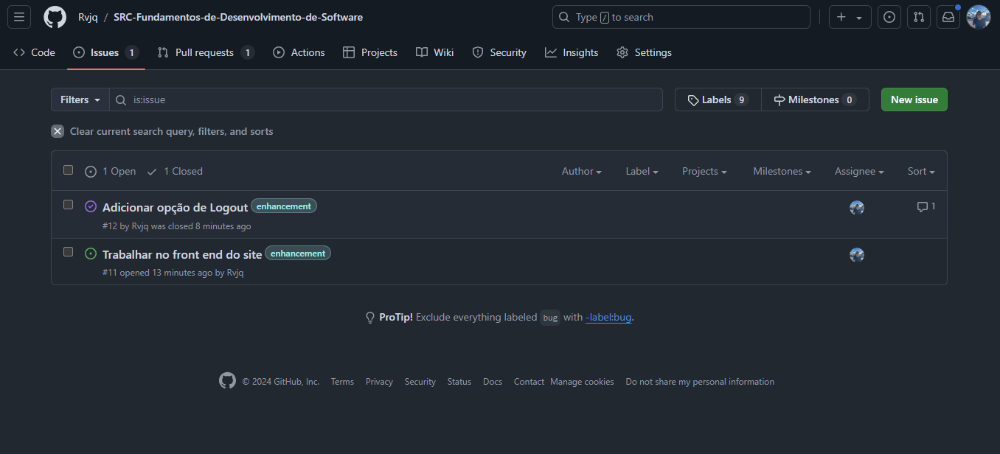
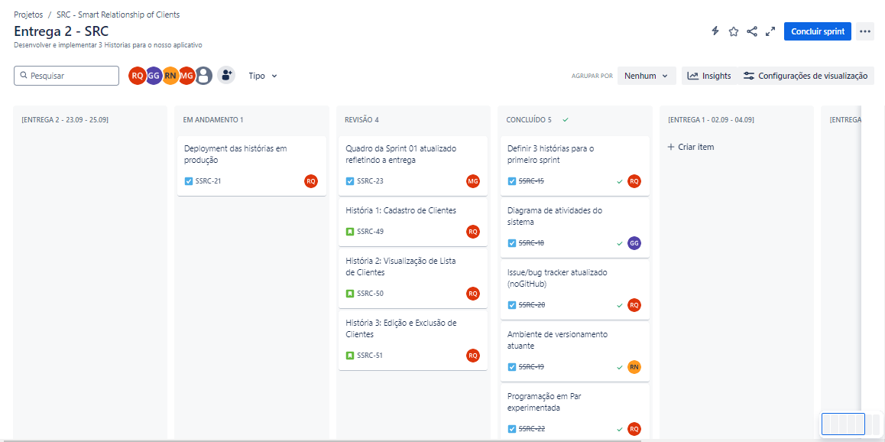
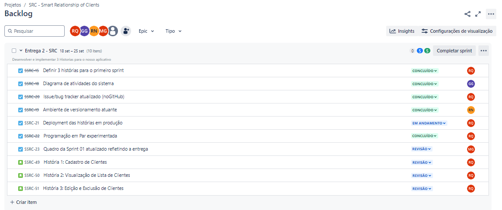

<div align="center">
    <h1>
        <b font-size: 20px;>🚀 SRC - Smart Relationship of Clients 🌟</b>
        </br>
        </br>
        
    </h1>
</div>

<p align="center">
  
  
  
  <a href="LICENSE"
    ></a>
</p>

> [!NOTE]
> Projeto em inicio de desenvolvimento, sujeito a mudanças.

---

</br>
<p align="center">
    A SRC é uma solução poderosa e intuitiva, desenvolvida para transformar a maneira como sua empresa se relaciona com os clientes. Com uma interface amigável e funcionalidades avançadas, o SRC permite gerenciar todas as interações com seus clientes em um único lugar, promovendo um relacionamento mais próximo e personalizado. ⚡
</p>

## ⚙ Tecnologias Utilizadas

- **Linguagem de Programação**:<br>

- **Banco de Dados**:<br>


- **Framework de Desenvolvimento**:<br>

- **Frontend**:<br>

- **Organização**:<br>

## 🖇️ Links Importantes

<ul>
  <li>
    <a  href="">
      Link do Site</a
  </li> 

  <li>
    <a  href="https://cesar-team-e3314sym.atlassian.net/jira/software/projects/SSRC/boards/3?atlOrigin=eyJpIjoiNjM3NmRiYmYyNjk4NDFlOThkMTAxNTEwMmZmMzE0MjEiLCJwIjoiaiJ9"
      >Link do Jira</a
    >
  </li>
    <li>
    <a  href="https://drive.google.com/drive/u/4/folders/0AFF36nv8gFqdUk9PVA"
      >Google Drive</a
    >
  </li>
  
  <li>
    <a  href=""
      >Relatórios de Pair Programming</a
    >
  </li>
</ul>

## ♟️ Entregas

<details>
<summary>Entrega 1</summary>
<ul>
<li> [Link da entrega 1](https://drive.google.com/drive/u/4/folders/1EmybUog0gSd-5IMwIwxl0Fgz8bT8nZWN) </li>
<li>Kanban </li>
<li>Backlog </li>
<li>Storyboard 


[Link storyboard](https://www.figma.com/design/al5hOfTsa6lACnnjdWik5v/Untitled?node-id=0-1&node-type=CANVAS&t=drVKI27B0PURqVSL-0)</li>
<li>Protótipo(sketch)


[Link protótipo](https://www.figma.com/design/uWUO2t1XNSkiNllAtFBE8P/Untitled?node-id=0-1&node-type=CANVAS&t=PeLcBHo24RN81PXQ-0)</li>
<li>[Link screencast](https://drive.google.com/drive/u/4/folders/1EmybUog0gSd-5IMwIwxl0Fgz8bT8nZWN)</li>
</ul>
</details>

<details>
<summary>Entrega 2</summary>
<ul>
<li>[Drive entrega 2](https://drive.google.com/drive/folders/1sADwMFiU6Xi09-4iyYCNZOwYogaILmrP)</li>
<li>[Link Diagrama de atividades do sistema](https://www.figma.com/design/v2MFVdrlPt0dR9tNkSNnSO/Diagrama-de-atividades?node-id=0-1&node-type=canvas&t=VZspxOMO2nVTUHLc-0)</li>
<li>[Relatorio programação em par](https://docs.google.com/document/d/1ibIL1OkDHEmPx4BmkdCzSgLIkITkaGlZJEfXKGVOQrg/edit?usp=sharing)</li>
<li>[Issue Tracker](https://github.com/Rvjq/SRC-Fundamentos-de-Desenvolvimento-de-Software/issues?q=is%3Aissue+)</li>
<li>[Quadro da Sprint 1](https://cesar-team-e3314sym.atlassian.net/jira/software/projects/SSRC/boards/3?atlOrigin=eyJpIjoiODgwZjczZGIzMDIxNDYzMzhhZTAwZGEyNzNlMzk1N2IiLCJwIjoiaiJ9)</li>
</ul>
</details>

<details>
<summary>Entrega 3</summary>
<ul>
</ul>
</details>

<details>
<summary>Entrega 4</summary>
<ul>
</ul>
</details>


## 💪 Nossa Equipe

*👨‍💼 Terry Damasio Santos - Project Manager

*👨‍💻 Rafael Varela Queimado

*👨‍💻 Heitor Santana Freitas Monteiro

*👨‍💻 Kerry Muniz Santos

*👩‍💻 ⁠Maria Júlia de Paula Martins Germano

*👨‍💻 Ricardo Block Veras Franco Neves

## ⚙️ Configuração rapida do projeto

### 💻 Criando virtual environment

>Criar venv

```powershell
python.exe -m venv env 
```

>Caso esteja sendo configurado em um computador do Cesar :shipit: executar o seguinte Script

```powershell
Set-ExecutionPolicy RemoteSigned -Scope CurrentUser
```

>Ativar venv

```powershell
./env/Scripts/activate
```

>Instalar Dependencias do projeto (libs)

```powershell
pip.exe install -r requirements.txt
```

>O seguinte script atualiza a lista de dependencias (libs)

```powershell
python.exe -m pip freeze > requirements.txt
```

### 🏃 Rodando o Servidor Dev Local

>Navegue para a pasta Raiz do projeto

```bat
cd SRC
```

>Rode o servidor

```powershell
python.exe manage.py runserver
```
